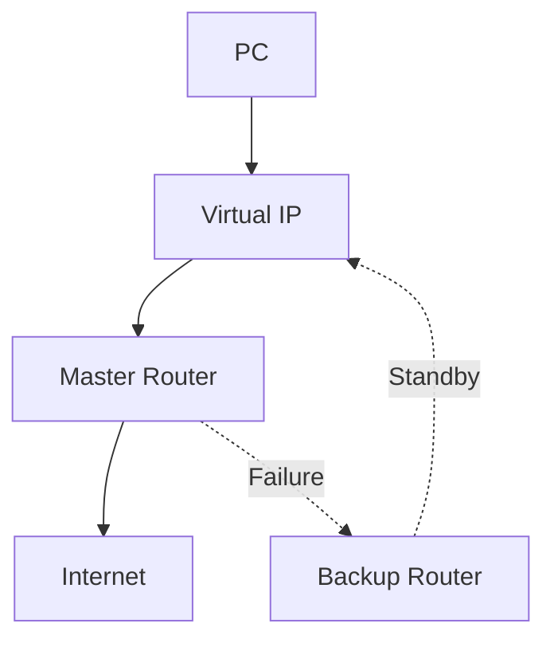

# 01. VRRP 개요 (Virtual Router Redundancy Protocol)

---

# 학습 목표

이 장에서는 VRRP의 개념과 등장 배경을 이해한다.

- VRRP가 왜 필요한지 설명할 수 있다.
- Gateway Redundancy의 개념을 이해한다.
- VRRP가 제공하는 고가용성(High Availability)을 설명할 수 있다.
- HSRP, GLBP와의 차이를 이해한다.

---

# VRRP란?

VRRP(Virtual Router Redundancy Protocol)는 여러 대의 물리 Router를 하나의 Virtual Router로 그룹화하여 사용자에게 하나의 기본 Gateway를 제공하는 표준 프로토콜이다.

VRRP는 OSI 3계층(Network Layer)에서 동작하며, Gateway 장애가 발생하면 Backup Router가 자동으로 Master 역할을 이어받아 서비스 연속성을 보장한다.

VRRP는 IETF 표준 프로토콜로 RFC 3768(IPv4)에서 처음 정의되었으며, RFC 5798에서 IPv4와 IPv6를 모두 지원하도록 확장되었다.

벤더 독립적인 표준 프로토콜이므로 서로 다른 제조사의 Router와 L3 Switch 간에도 이중화 구성이 가능하다.

---

# VRRP가 필요한 이유

일반적인 네트워크에서는 PC의 Default Gateway를 하나의 Router로 설정한다.

예를 들어

PC

↓

Router

↓

Internet

이 구조에서는 Router가 장애가 발생하면 내부 네트워크는 정상이어도 외부와 통신할 수 없다.

즉,

Gateway 하나가 전체 네트워크의 Single Point of Failure(SPOF)가 된다.

VRRP는 이러한 문제를 해결하기 위해 등장하였다.

---

# VRRP의 목적

VRRP는 다음과 같은 목적을 가진다.

- Gateway 이중화
- 장애 자동 복구(Failover)
- 서비스 연속성 확보
- 네트워크 가용성 향상
- 사용자 설정 변경 없이 Gateway 유지

---

# VRRP 구조

```text
사용자

↓

Virtual IP (Gateway)

↓

Master Router
        │
        │ 장애 발생
        ▼
Backup Router

↓

Internet
```

사용자는 Virtual IP만 Gateway로 설정하면 된다.

실제 Master Router가 변경되어도 사용자는 이를 알 필요가 없다.

---

# VRRP 특징

- OSI Layer 3(Network Layer)에서 동작
- Gateway 이중화를 제공
- Virtual IP와 Virtual MAC 사용
- Master 장애 시 Backup이 자동 승격(Failover)
- RFC 5798 기반의 IETF 표준 프로토콜
- 벤더 독립적인 프로토콜
- High Availability(고가용성) 제공
- 
---

# VRRP와 HSRP 비교


| 구분 | VRRP | HSRP | GLBP |
|------|------|------|------|
| 표준/제조사 | IETF 표준(RFC 5798) | Cisco 독자 | Cisco 독자 |
| 가상 IP | 1개 | 1개 | 1개 |
| 로드밸런싱 | 미지원 | 미지원 | 지원 |
| 멀티캐스트 | 224.0.0.18 | 224.0.0.102 | 224.0.0.102 |

---

# 실제 동작 예시

Router A

Priority 150

↓

Master

↓

Virtual IP = 192.168.0.254

↓

PC Gateway

Router B

Priority 100

↓

Backup

↓

대기

↓

Router A 장애 발생

↓

Router B → Master 승격

↓

사용자는 Gateway 변경 없이 계속 통신

---

# Mermaid 다이어그램



---

# 핵심 용어

Virtual Router

: 여러 Router를 하나의 Router처럼 동작시키는 논리적 Router

Virtual IP

: 사용자가 Gateway로 사용하는 가상 IP

Master

: 현재 Gateway 역할을 수행하는 Router

Backup

: Master 장애 시 대기하는 Router

Failover

: 장애 발생 시 Backup이 Master 역할을 수행하는 과정

High Availability

: 장애가 발생해도 서비스를 계속 제공하는 기술

---

# Wireshark에서 확인

VRRP Advertisement Packet

Protocol Number = 112

Destination = 224.0.0.18

TTL = 255

---

# 시험 핵심

✔ VRRP는 Gateway 이중화를 위한 프로토콜이다.

✔ Virtual IP를 Gateway로 사용한다.

✔ Master 장애 시 Backup이 자동 승격된다.

✔ VRRP는 RFC 표준 프로토콜이다.

✔ High Availability를 제공한다.

---

# 암기법

VRRP

↓

Virtual Router

↓

Virtual IP

↓

Master

↓

Backup

↓

Failover

↓

High Availability

---

# 면접 질문

Q. VRRP가 필요한 이유는 무엇인가?

Q. VRRP와 HSRP의 차이는 무엇인가?

Q. Virtual IP를 사용하는 이유는 무엇인가?

Q. Failover란 무엇인가?

---

# 핵심 요약

VRRP는 여러 Router를 하나의 Virtual Gateway처럼 동작시키는 표준 프로토콜이다.

사용자는 하나의 Gateway만 사용하면 되고, Master Router 장애 시 Backup Router가 자동으로 Master 역할을 이어받아 네트워크 서비스를 계속 제공한다.