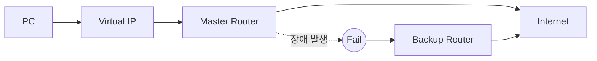

# 02. VRRP 필요성

---

# 학습 목표

이 장에서는 VRRP가 왜 필요한지 이해한다.

- Gateway 장애가 네트워크에 미치는 영향을 이해한다.
- Single Point of Failure(SPOF)를 설명할 수 있다.
- VRRP가 장애를 어떻게 해결하는지 이해한다.
- Failover 과정을 설명할 수 있다.

---

# 왜 VRRP가 필요한가?

기업 네트워크에서는 대부분의 PC가 하나의 Default Gateway를 사용한다.

PC는 인터넷이나 다른 네트워크로 통신할 때 반드시 Gateway를 거쳐야 한다.

따라서 Gateway가 장애가 발생하면 내부 네트워크는 정상이어도 외부와의 모든 통신이 중단된다.

즉,

Gateway는 네트워크에서 가장 중요한 장비 중 하나이다.

---

# 일반적인 네트워크 구조

```text
           Internet
               │
               │
         ┌──────────┐
         │  Router  │
         └──────────┘
               │
        ┌─────────────┐
        │   Switch    │
        └─────────────┘
         │     │     │
        PC1   PC2   PC3
```

모든 PC는 하나의 Router만 Gateway로 사용한다.

---

# 문제점

Router가 장애가 발생하면

```text
           Internet
               │
               X
         ┌──────────┐
         │  Router  │
         └──────────┘
               │
        ┌─────────────┐
        │   Switch    │
        └─────────────┘
         │     │     │
        PC1   PC2   PC3
```

모든 PC는 인터넷과의 연결이 끊어진다.

이를

**Single Point of Failure(SPOF)**

라고 한다.

---

# Single Point of Failure(SPOF)

SPOF란

하나의 장비가 장애가 발생했을 때 전체 시스템이 중단되는 구조를 의미한다.

대표적인 SPOF

- Gateway
- Firewall
- Core Switch
- DNS Server
- DHCP Server

기업 네트워크에서는 이러한 SPOF를 제거하는 것이 매우 중요하다.

---

# VRRP를 적용하면

VRRP는 두 대 이상의 Router를 하나의 Gateway처럼 동작시킨다.

```text
              Internet
                  │
        ┌─────────────────┐
        │  Virtual Router │
        └─────────────────┘
          │             │
   ┌────────────┐ ┌────────────┐
   │ Master     │ │ Backup     │
   │ Router     │ │ Router     │
   └────────────┘ └────────────┘
           │
      ┌──────────┐
      │ Switch   │
      └──────────┘
       │    │    │
      PC1  PC2  PC3
```

사용자는 두 대의 Router를 알 필요가 없다.

Gateway는 하나만 사용하는 것처럼 보인다.

---

# 장애 발생

Master Router가 정상인 경우

```text
PC

↓

Virtual IP

↓

Master Router

↓

Internet
```

Master Router 장애 발생

```text
PC

↓

Virtual IP

↓

Backup Router

↓

Internet
```

Gateway 주소는 변하지 않는다.

사용자는 장애를 거의 느끼지 못한다.

---

# Failover

Failover란

현재 장비가 장애가 발생하면

대기 중인 장비가 자동으로 서비스를 이어받는 기술이다.

VRRP의 핵심 기능이 바로 Failover이다.

---

# VRRP가 제공하는 효과

├─ Gateway 이중화

├─ 장애 자동 복구

├─ 서비스 중단 최소화

├─ 고가용성(High Availability)

├─ 네트워크 안정성 향상

└─ 사용자 설정 변경 불필요

---

# Mermaid 다이어그램



---

# 실제 예시

회사에서는 Gateway를

192.168.10.254

로 설정하였다.

Master Router가 장애가 발생하면

Backup Router가

동일한 Virtual IP

192.168.10.254

를 이어받는다.

따라서 모든 PC는 Gateway를 다시 설정하지 않아도 된다.

---

# Wireshark에서 확인

Master Router는

1초마다 Advertisement Packet을 전송한다.

Backup Router는 이를 계속 감시한다.

Advertisement가 일정 시간 동안 도착하지 않으면

Master 장애로 판단한다.

---

# 시험 핵심

✔ Gateway 장애는 전체 네트워크 장애로 이어질 수 있다.

✔ 이를 SPOF라고 한다.

✔ VRRP는 Gateway 이중화를 제공한다.

✔ Master 장애 시 Backup이 자동 승격된다.

✔ Virtual IP는 변경되지 않는다.

---

# 암기법

Gateway

↓

SPOF

↓

VRRP

↓

Master

↓

Failure

↓

Backup

↓

Failover

↓

서비스 지속

---

# 면접 질문

Q. VRRP가 필요한 이유는 무엇인가?

Q. SPOF란 무엇인가?

Q. Failover란 무엇인가?

Q. 사용자가 장애를 느끼지 못하는 이유는 무엇인가?

---

# 핵심 요약

VRRP는 Gateway의 Single Point of Failure를 제거하기 위한 프로토콜이다.

Master Router에 장애가 발생하면 Backup Router가 동일한 Virtual IP를 이어받아 Gateway 역할을 수행하므로 사용자는 별도의 설정 변경 없이 계속 통신할 수 있다.