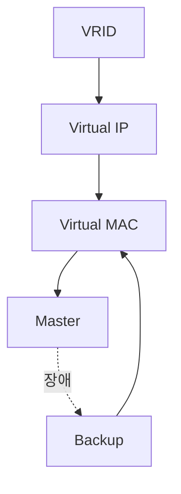

# 03. VRID, Virtual IP, Virtual MAC

---

# 학습 목표

이 장에서는 VRRP를 구성하는 핵심 요소를 이해한다.

- VRID의 역할을 설명할 수 있다.
- Virtual IP의 개념을 이해한다.
- Virtual MAC의 동작 원리를 이해한다.
- ARP와 Virtual MAC의 관계를 설명할 수 있다.

---

# VRRP의 핵심 구성요소

VRRP는 여러 Router를 하나의 Virtual Router처럼 동작시키기 위해
다음과 같은 구성 요소를 사용한다.

├─ VRID (Virtual Router ID)

├─ Virtual IP

├─ Virtual MAC

├─ Master Router

└─ Backup Router

---

# VRID (Virtual Router Identifier)

VRID는 하나의 Virtual Router를 식별하기 위한 번호이다.

같은 VRRP 그룹에 속한 Router는 반드시 동일한 VRID를 사용해야 한다.

VRID는 하나의 그룹 번호라고 생각하면 이해하기 쉽다.

예를 들어

Router A

VRID = 10

↓

Router B

VRID = 10

↓

같은 VRRP 그룹

만약

Router C

VRID = 20

이라면

다른 VRRP 그룹으로 동작한다.

---

# Virtual IP

Virtual IP는 사용자가 실제 Gateway로 사용하는 IP 주소이다.

사용자는 실제 Router의 IP를 알 필요가 없다.

오직 Virtual IP만 Gateway로 설정한다.

예)

Router A

192.168.10.1

Router B

192.168.10.2

Virtual IP

192.168.10.254

사용자 Gateway

↓

192.168.10.254

Master가 변경되어도

Virtual IP는 변하지 않는다.

---

# Virtual MAC

IP에는 반드시 MAC Address가 존재한다.

Virtual IP도 동일하게

Virtual MAC을 가진다.

즉

PC는

Virtual MAC으로 패킷을 전송한다.

Master Router가 변경되면

새로운 Master가

동일한 Virtual MAC을 사용한다.

따라서

PC는 ARP를 다시 수행하지 않아도 된다.

---

# Virtual MAC 형식

VRRP에서 사용하는 Virtual MAC 주소는

```
00-00-5E-00-01-XX
```

형식을 사용한다.

여기서

XX는 VRID를 의미한다.

예)

VRID = 10

↓

Virtual MAC

00-00-5E-00-01-0A

---

# ARP와 Virtual MAC

PC는 처음 통신할 때

Gateway의 MAC Address를 알아야 한다.

ARP Request

↓

"192.168.10.254 누구?"

↓

Master Router 응답

↓

Virtual MAC 전달

↓

ARP Table 저장

이후에는

PC가 항상

Virtual MAC으로 통신한다.

---

# 장애 발생 시

Master Router 장애

↓

Backup Router 승격

↓

동일한 Virtual IP 사용

↓

동일한 Virtual MAC 사용

↓

ARP 변경 없음

↓

통신 지속

사용자는

Gateway가 변경된 사실을 알지 못한다.

---

# 구성요소 관계

```text
VRRP Group

        │

        ▼

      VRID

        │

        ▼

 Virtual IP

        │

        ▼

 Virtual MAC

        │

        ▼

Master Router

        │

        ▼

Backup Router
```

---

# Mermaid 다이어그램



---

# 실제 통신 과정

PC

↓

Gateway = 192.168.10.254

↓

ARP Request

↓

Master Router

↓

Virtual MAC 응답

↓

Packet 전송

↓

Master 장애

↓

Backup 승격

↓

동일 Virtual MAC 사용

↓

계속 통신

---

# 핵심 용어

VRID

: Virtual Router를 식별하는 그룹 번호

Virtual IP

: 사용자가 Gateway로 사용하는 IP

Virtual MAC

: Virtual IP에 대응되는 MAC Address

Master

: 현재 Gateway 역할을 수행하는 Router

Backup

: Master 장애 시 Gateway 역할을 이어받는 Router

---

# Wireshark에서 확인

ARP Reply

↓

Sender IP

192.168.10.254

↓

Sender MAC

00-00-5E-00-01-XX

↓

Virtual MAC 확인 가능

---

# 시험 핵심

✔ VRID는 Virtual Router를 식별하는 번호이다.

✔ Virtual IP는 사용자가 Gateway로 사용하는 IP이다.

✔ Virtual MAC은 Virtual IP에 대응되는 MAC이다.

✔ Master 변경 시 Virtual MAC도 그대로 유지된다.

✔ ARP를 다시 수행하지 않아도 된다.

---

# 암기법

VRID

↓

Virtual Router

↓

Virtual IP

↓

Virtual MAC

↓

ARP

↓

Master

↓

Backup

---

# 면접 질문

Q. VRID란 무엇인가?

Q. Virtual IP를 사용하는 이유는 무엇인가?

Q. Virtual MAC은 왜 필요한가?

Q. Master가 변경되어도 통신이 끊기지 않는 이유는 무엇인가?

---

# 핵심 요약

VRRP는 VRID를 이용하여 Virtual Router를 구성하고,
Virtual IP와 Virtual MAC을 통해 하나의 Gateway처럼 동작한다.

Master Router가 변경되더라도 Virtual IP와 Virtual MAC은 유지되므로
사용자는 별도의 설정 변경 없이 계속 통신할 수 있다.