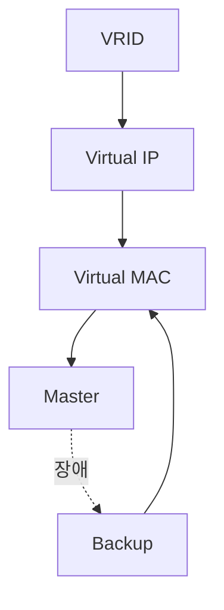

# 03. VRID, Virtual IP, Virtual MAC

---

# 학습 목표

이 장에서는 VRRP를 구성하는 핵심 요소를 이해한다.

- VRID의 역할을 설명할 수 있다.
- Virtual IP의 개념을 이해한다.
- Virtual MAC의 동작 원리를 이해한다.
- ARP와 Virtual MAC의 관계를 설명할 수 있다.

---

# VRRP의 핵심 구성요소

VRRP는 여러 Router를 하나의 Virtual Router처럼 동작시키기 위해 다음과 같은 구성 요소를 사용한다.

├─ VRID (Virtual Router ID)

├─ Virtual IP

├─ Virtual MAC

├─ Master Router

└─ Backup Router

---

# VRID (Virtual Router Identifier)

VRID(Virtual Router ID)는 VRRP 그룹을 식별하는 0~255 사이의 번호이다.

동일한 VRID를 설정한 Router들은 하나의 Virtual Router 그룹을 구성하며, 같은 Virtual IP와 Virtual MAC을 공유한다.

하나의 인터페이스에서 여러 VRID 그룹을 동시에 운영할 수 있으며, 이를 이용하여 부하를 분산할 수 있다.

동일한 네트워크에서는 VRID가 중복되지 않도록 설계해야 한다.

---

# VRID 부하 분산 예시

```text
VRID 10
   │
   └── Router A → Master

VRID 20
   │
   └── Router B → Master
```

여러 개의 VRRP 그룹을 구성하면 Router별로 Master 역할을 나누어 부하를 분산할 수 있다.

---

# 설정 예시

```bash
interface GigabitEthernet0/0

vrrp 10 ip 192.168.10.254
```

---

# Virtual IP

Virtual IP는 사용자가 기본 Gateway로 설정하는 그룹 공통 IP 주소이다.

실제 Router의 물리 IP와는 별개이며, 사용자는 Virtual IP만 Gateway로 설정한다.

예)

```
Router A

192.168.10.1

Router B

192.168.10.2

Virtual IP

192.168.10.254

사용자 Gateway

192.168.10.254
```

Master Router가 변경되어도 Virtual IP는 변하지 않는다.

---

# Virtual MAC

Virtual MAC은 Virtual IP에 대응되는 MAC Address이다.

VRRP는 다음 형식의 Virtual MAC을 사용한다.

```
00-00-5E-00-01-{VRID}
```

예)

```
VRID = 10

↓

Virtual MAC

00-00-5E-00-01-0A
```

Master Router는 Virtual IP와 Virtual MAC에 대한 ARP 요청에 응답하며 트래픽을 처리한다.

Failover가 발생해도 Virtual IP와 Virtual MAC은 그대로 유지되므로 단말은 ARP를 다시 수행하지 않고 계속 통신할 수 있다.

---

# ARP와 Virtual MAC

PC는 처음 통신할 때 Gateway의 MAC Address를 알아야 한다.

```
ARP Request

↓

"192.168.10.254 누구?"

↓

Master Router

↓

Virtual MAC 응답

↓

ARP Table 저장
```

이후 PC는 Virtual MAC으로 계속 통신한다.

---

# 장애 발생 시

```text
Master Router 장애

↓

Backup Router 승격

↓

동일한 Virtual IP 사용

↓

동일한 Virtual MAC 사용

↓

ARP 변경 없음

↓

통신 지속
```

사용자는 Gateway가 변경된 사실을 알지 못한다.

---

# 구성요소 관계

```text
VRRP Group

      │

      ▼

    VRID

      │

      ▼

 Virtual IP

      │

      ▼

 Virtual MAC

      │

      ▼

Master Router

      │

      ▼

Backup Router
```

---

# Mermaid 다이어그램



---

# 실제 통신 과정

```text
PC

↓

Gateway = 192.168.10.254

↓

ARP Request

↓

Master Router

↓

Virtual MAC 응답

↓

Packet 전송

↓

Master 장애

↓

Backup 승격

↓

동일 Virtual MAC 사용

↓

계속 통신
```

---

# 핵심 용어

VRID

: Virtual Router를 식별하는 그룹 번호

Virtual IP

: 사용자가 Gateway로 사용하는 IP

Virtual MAC

: Virtual IP에 대응되는 MAC Address

Master

: 현재 Gateway 역할을 수행하는 Router

Backup

: Master 장애 시 Gateway 역할을 이어받는 Router

---

# Wireshark에서 확인

ARP Reply

↓

Sender IP

192.168.10.254

↓

Sender MAC

00-00-5E-00-01-XX

↓

Virtual MAC 확인 가능

---

# 시험 핵심

✔ VRID는 Virtual Router를 식별하는 번호이다.

✔ Virtual IP는 사용자가 Gateway로 사용하는 IP이다.

✔ Virtual MAC은 Virtual IP에 대응되는 MAC이다.

✔ Master Router는 ARP 요청에 응답한다.

✔ Failover가 발생해도 Virtual IP와 Virtual MAC은 유지된다.

✔ ARP를 다시 수행하지 않아도 된다.

---

# 암기법

VRID

↓

Virtual Router

↓

Virtual IP

↓

Virtual MAC

↓

ARP

↓

Master

↓

Backup

---

# 면접 질문

Q. VRID란 무엇인가?

Q. Virtual IP를 사용하는 이유는 무엇인가?

Q. Virtual MAC은 왜 필요한가?

Q. Master가 변경되어도 통신이 끊기지 않는 이유는 무엇인가?

---

# 핵심 요약

VRID는 Virtual Router 그룹을 식별하는 번호이며, 같은 VRID를 가진 Router들은 하나의 Virtual Router를 구성한다.

사용자는 Virtual IP를 Gateway로 사용하고, Master Router는 Virtual MAC으로 ARP 요청에 응답한다.

Failover가 발생해도 Virtual IP와 Virtual MAC은 유지되므로 사용자는 별도의 설정 변경 없이 계속 통신할 수 있다.