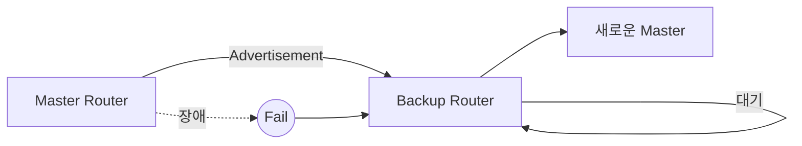

# 04. Priority와 Advertisement

---

# 학습 목표

이 장에서는 VRRP에서 Master Router가 어떻게 결정되는지 이해한다.

- Priority의 의미를 설명할 수 있다.
- Master와 Backup의 역할을 이해한다.
- Advertisement Packet의 역할을 설명할 수 있다.
- Master 장애를 어떻게 감지하는지 이해한다.

---

# Priority란?

Priority는 VRRP 그룹에서 어떤 Router가 Master가 될지를 결정하는 우선순위 값이다.

Priority 값이 높은 Router가 Master Router가 된다.

즉,

Priority는

"누가 Gateway 역할을 수행할 것인가?"

를 결정하는 기준이다.

---

# Priority 범위

Priority 값은

0 ~ 255

사이를 사용한다.

대표적으로

Priority = 255

↓

Virtual IP Owner

↓

가장 높은 우선순위

Priority = 100

↓

기본(Default) 값

Priority = 0

↓

Master 역할 포기

↓

Backup에게 즉시 양보

---

# Master Router

Master Router는 실제 Gateway 역할을 수행하는 Router이다.

Master Router만

- ARP 응답
- Packet 전달
- Advertisement 전송

을 수행한다.

즉,

현재 서비스를 제공하는 Router가

Master이다.

---

# Backup Router

Backup Router는 Master를 대신하기 위해 대기하는 Router이다.

평상시에는

사용자 Packet을 전달하지 않는다.

대신

Master가 보내는 Advertisement를 계속 감시한다.

Advertisement가 사라지면

Master 장애로 판단한다.

---

# Advertisement란?

Advertisement는

Master Router가

"나는 정상적으로 동작 중이다."

라는 사실을 Backup Router에게 알려주는 VRRP 메시지이다.

Master는 일정한 간격으로

Advertisement Packet을 전송한다.

Backup은 이를 수신하면서

Master의 생존 여부를 확인한다.

---

# Advertisement 전송 과정

```text
Master

↓

Advertisement

↓

Backup

↓

Master 정상

↓

계속 대기
```

Master가

계속 Advertisement를 보내면

Backup은 아무 동작도 하지 않는다.

---

# Master 장애

Master 장애 발생

↓

Advertisement 중단

↓

Backup Timer 만료

↓

Master Down 판단

↓

새로운 Master 선출

↓

Gateway 유지

즉,

Advertisement가 끊기는 것이

장애를 감지하는 기준이다.

---

# Advertisement 특징

VRRP Advertisement는

다음과 같은 특징을 가진다.

├─ Master만 전송

├─ Backup은 수신만 수행

├─ 기본 1초 간격

├─ Multicast 사용

├─ Protocol Number = 112

└─ TTL = 255

---

# Multicast 주소

VRRP는

다음 Multicast 주소를 사용한다.

224.0.0.18

같은 VRRP 그룹의 Router만

Advertisement를 수신한다.

---

# TTL = 255

VRRP Advertisement는

TTL(Time To Live)을

255로 설정한다.

이는

다른 네트워크를 거쳐 전달되지 않도록 하기 위한 보안 기능이다.

즉,

같은 LAN 안에서만

VRRP가 동작하도록 만든 것이다.

---

# 동작 흐름

```text
Priority 비교

↓

Master 결정

↓

Advertisement 전송

↓

Backup 수신

↓

Advertisement 정상

↓

계속 대기

↓

Advertisement 중단

↓

Master Down

↓

Backup 승격
```

---

# Mermaid 다이어그램



---

# 실제 예시

Router A

Priority = 150

↓

Master

↓

Advertisement 전송

Router B

Priority = 100

↓

Backup

↓

Advertisement 수신

Router A 장애

↓

Advertisement 중단

↓

Router B

↓

Master 승격

---

# Wireshark에서 확인

Protocol

112

Destination

224.0.0.18

TTL

255

Packet Type

Advertisement

---

# 시험 핵심

✔ Priority가 높은 Router가 Master가 된다.

✔ Master만 Advertisement를 전송한다.

✔ Backup은 Advertisement를 감시한다.

✔ Advertisement가 끊기면 Master Down으로 판단한다.

✔ VRRP는 Multicast 224.0.0.18을 사용한다.

✔ Protocol Number는 112이다.

✔ TTL은 255이다.

---

# 암기법

Priority

↓

Master

↓

Advertisement

↓

Backup

↓

Master Down

↓

Failover

↓

새 Master

---

# 면접 질문

Q. Priority의 역할은 무엇인가?

Q. Advertisement Packet은 왜 필요한가?

Q. Backup은 Master 장애를 어떻게 감지하는가?

Q. VRRP에서 TTL을 255로 사용하는 이유는 무엇인가?

---

# 핵심 요약

VRRP는 Priority를 이용하여 Master Router를 선출한다.

Master는 Advertisement Packet을 주기적으로 전송하여 자신의 생존을 알리고,
Backup은 이를 감시하다가 Advertisement가 중단되면 Master 장애로 판단하여
자동으로 새로운 Master 역할을 수행한다.