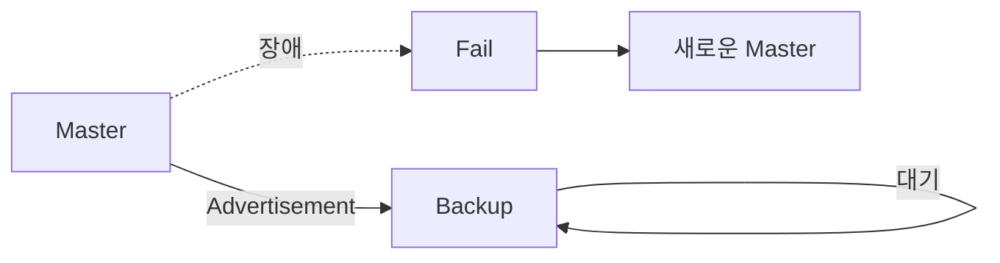

# 04. Priority와 Advertisement

---

# 학습 목표

이 장에서는 VRRP에서 Master Router가 어떻게 결정되는지 이해한다.

- Priority의 의미를 설명할 수 있다.
- Master와 Backup의 역할을 이해한다.
- Advertisement Packet의 역할을 설명할 수 있다.
- Master 장애를 어떻게 감지하는지 이해한다.

---

# Priority란?

Priority는 VRRP 그룹에서 어떤 Router가 Master가 될지를 결정하는 우선순위 값이다.

Priority 값이 가장 높은 Router가 Master Router가 되며, 나머지 Router는 Backup으로 대기한다.

즉, Priority는

"누가 Gateway 역할을 수행할 것인가?"

를 결정하는 기준이다.

---

# Priority 범위

Priority는 0~255 사이의 값을 사용한다.

대표적인 값은 다음과 같다.

```
Priority = 255

↓

Virtual IP Owner

↓

항상 Master

-----------------------

Priority = 100

↓

기본(Default) 값

-----------------------

Priority = 0

↓

Master 역할 포기

↓

Backup 즉시 선출
```

---

# Priority 비교 예시

```text
Router A

Priority = 150

↓

Master

-------------------

Router B

Priority = 100

↓

Backup

-------------------

Router C

Priority = 80

↓

Backup
```

---

# Advertisement란?

Advertisement는 Master Router가

"나는 현재 정상적으로 동작하고 있다."

라는 사실을 Backup Router에게 주기적으로 알리는 제어 메시지이다.

Master Router는 Advertisement Packet을 주기적으로 전송하고,

Backup Router는 이를 계속 수신하면서 Master의 생존 여부를 확인한다.

---

# Advertisement 특징

VRRP Advertisement는 다음과 같은 특징을 가진다.

- 목적지 : 224.0.0.18
- IP Protocol Number : 112
- TTL : 255
- 기본 전송 주기 : 1초
- 포함 정보 : Priority, VRID, Virtual IP 목록

---

# Advertisement 전송 과정

```text
Master

↓

Advertisement

↓

Backup

↓

Master 정상

↓

계속 대기
```

Master가 Advertisement를 계속 전송하면 Backup은 아무 동작도 하지 않는다.

---

# Master 장애

```text
Master 장애

↓

Advertisement 중단

↓

Backup이 일정 시간 동안 Advertisement 미수신

↓

Master Down 판단

↓

새로운 Master 선출

↓

Gateway 유지
```

Advertisement가 끊기는 것이 Master 장애를 판단하는 기준이다.

---

# 동작 흐름

```text
Priority 비교

↓

Master 결정

↓

Advertisement 전송

↓

Backup 수신

↓

Master 정상

↓

계속 대기

↓

Advertisement 중단

↓

Master Down

↓

새로운 Master
```

---

# Mermaid 다이어그램



---

# Wireshark에서 확인

```
Destination

224.0.0.18

↓

Protocol

112

↓

TTL

255

↓

Advertisement
```

---

# 시험 핵심

✔ Priority가 가장 높은 Router가 Master가 된다.

✔ Priority 255는 Virtual IP Owner이다.

✔ Priority 0은 Master 역할을 포기한다.

✔ Master만 Advertisement를 전송한다.

✔ Backup은 Advertisement를 감시한다.

✔ 목적지는 224.0.0.18이다.

✔ Protocol Number는 112이다.

✔ TTL은 255이다.

---

# 암기법

Priority

↓

Master

↓

Advertisement

↓

Backup

↓

Master Down

↓

Failover

---

# 면접 질문

Q. Priority의 역할은 무엇인가?

Q. Priority 255와 0의 의미는 무엇인가?

Q. Advertisement Packet은 왜 필요한가?

Q. Backup은 Master 장애를 어떻게 감지하는가?

Q. VRRP에서 TTL을 255로 사용하는 이유는 무엇인가?

---

# 핵심 요약

Priority는 Master Router를 결정하는 우선순위 값이며, 가장 높은 Priority를 가진 Router가 Master가 된다.

Master는 Advertisement Packet을 주기적으로 전송하여 자신의 생존 상태를 알리고, Backup은 이를 감시하다가 Advertisement가 일정 시간 동안 도착하지 않으면 Master 장애로 판단하여 새로운 Master로 승격한다.