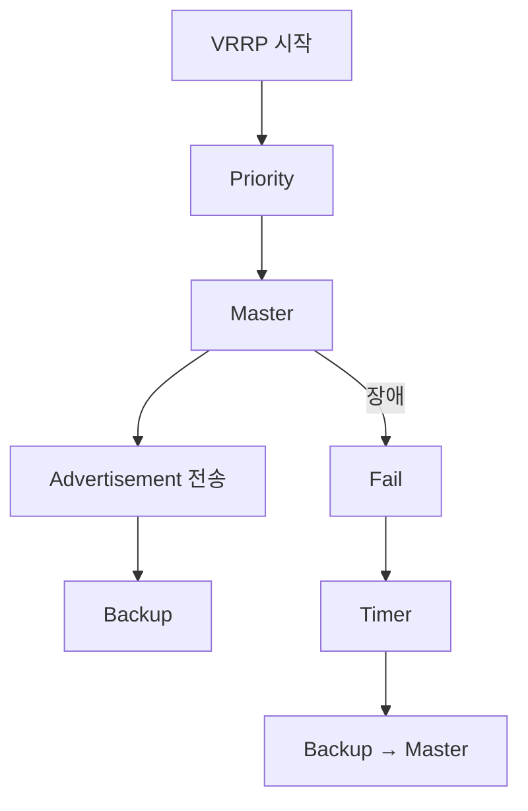

# 06. Master 선출과 Failover

---

# 학습 목표

이 장에서는 VRRP에서 Master Router가 어떻게 선출되고,
장애 발생 시 Backup Router가 어떻게 Gateway 역할을 이어받는지 이해한다.

- Master 선출 과정을 설명할 수 있다.
- Backup Router의 역할을 이해한다.
- Failover 과정을 설명할 수 있다.
- Preempt 기능을 이해한다.

---

# Master 선출이란?

VRRP 그룹에는 여러 대의 Router가 존재하지만

실제로 Gateway 역할을 수행하는 Router는

단 하나뿐이다.

이를

Master Router

라고 한다.

나머지 Router는

Backup Router

로 대기한다.

---

# Master 선출 기준

VRRP는

Priority 값을 비교하여

Master Router를 결정한다.

Priority가 가장 높은 Router가

Master가 된다.

예)

```text
Router A

Priority = 150

↓

Master


Router B

Priority = 120

↓

Backup


Router C

Priority = 100

↓

Backup
```

---

# Master 선출 과정

Router들이 동시에 VRRP 그룹에 참여하면

다음 순서로 Master가 결정된다.

```text
VRRP 그룹 생성

↓

Advertisement 수신

↓

Priority 비교

↓

가장 높은 Priority 선택

↓

Master 결정

↓

나머지는 Backup
```

---

# Master의 역할

Master Router는

Virtual Gateway 역할을 수행한다.

Master가 수행하는 작업

├─ Advertisement 전송

├─ ARP 응답

├─ Virtual MAC 사용

├─ Packet 전달

└─ Gateway 서비스 제공

---

# Backup의 역할

Backup Router는

사용자 Packet을 전달하지 않는다.

Master가 정상인지

Advertisement Packet만 계속 감시한다.

Backup이 수행하는 작업

├─ Advertisement 수신

├─ Timer 유지

├─ Master 상태 감시

└─ 장애 발생 시 Master 승격

---

# 장애 발생(Failover)

Master Router가 장애가 발생하면

Advertisement Packet이 중단된다.

Backup Router는

Advertisement Timer가 만료되면

Master가 장애라고 판단한다.

즉,

```text
Master 장애

↓

Advertisement 중단

↓

Timer 만료

↓

Master Down

↓

Backup 승격

↓

새로운 Master
```

이 과정을

Failover

라고 한다.

---

# 실제 Failover 과정

장애 전

```text
PC

↓

Virtual Gateway

↓

Master Router

↓

Internet
```

장애 발생

```text
Master Router

↓

Fail
```

Backup Router

↓

Master 승격

↓

Virtual IP 사용

↓

Virtual MAC 사용

↓

Gateway 유지

↓

Internet
```

사용자는

Gateway 변경을 전혀 느끼지 못한다.

---

# Preempt 기능

Preempt는

더 높은 Priority를 가진 Router가

나중에 네트워크에 참여했을 때

자동으로 Master 역할을 다시 가져오는 기능이다.

예)

```text
Router A

Priority =150

↓

Master


Router A 장애

↓

Router B

Priority =100

↓

Master


Router A 복구

↓

Priority 비교

↓

Router A 다시 Master
```

이 기능이

Preempt이다.

---

# Preempt 비활성화

Preempt를 사용하지 않으면

현재 Master는

계속 Master 역할을 수행한다.

즉,

Router A가 복구되어도

Router B가 Master를 계속 유지한다.

---

# Master Down Interval

Backup Router는

Advertisement가 일정 시간 동안 도착하지 않으면

Master Down으로 판단한다.

즉

Advertisement가

연속으로 끊겨야

Failover가 발생한다.

---

# Master 선출 흐름

```text
VRRP 시작

↓

Priority 비교

↓

Master 선출

↓

Advertisement

↓

Backup 대기

↓

Master 장애

↓

Advertisement 중단

↓

Master Down

↓

Backup 승격

↓

새로운 Master
```

---

# Mermaid 다이어그램



---

# 실제 예시

Router A

Priority =150

↓

Master

Router B

Priority =120

↓

Backup

Router A 전원 OFF

↓

Advertisement 중단

↓

Router B

↓

Master 승격

↓

사용자는 계속 인터넷 사용 가능

---

# Wireshark에서 확인

정상

Advertisement Packet

1초마다 수신

장애

Advertisement 중단

새로운 Master

Advertisement 송신 시작

---

# 시험 핵심

✔ Priority가 가장 높은 Router가 Master가 된다.

✔ Backup은 Advertisement를 감시한다.

✔ Advertisement가 중단되면 Master Down으로 판단한다.

✔ Backup은 자동으로 Master로 승격된다.

✔ 이를 Failover라고 한다.

✔ Preempt는 높은 Priority Router가 Master를 다시 가져오는 기능이다.

---

# 암기법

Priority

↓

Master

↓

Advertisement

↓

Backup

↓

Fail

↓

Master Down

↓

Failover

↓

새 Master

↓

Preempt

---

# 면접 질문

Q. Master Router는 어떻게 결정되는가?

Q. Backup Router는 평상시에 무엇을 하는가?

Q. Failover란 무엇인가?

Q. Preempt 기능은 왜 필요한가?

Q. Advertisement Packet이 중단되면 어떤 일이 발생하는가?

---

# 핵심 요약

VRRP는 Priority를 이용하여 Master Router를 선출한다.

Master는 Gateway 역할을 수행하며 Advertisement Packet을 주기적으로 전송한다.

Backup Router는 이를 감시하다가 Advertisement가 일정 시간 동안 도착하지 않으면 Master 장애로 판단하고 자동으로 Master 역할을 이어받는다. 이 과정을 Failover라고 하며, Preempt 기능을 사용하면 더 높은 Priority를 가진 Router가 다시 Master 역할을 수행할 수 있다.