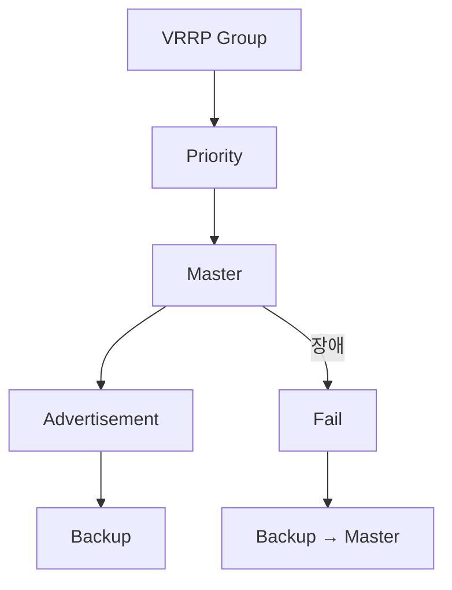

# 06. Master 선출과 Failover

---

# 학습 목표

이 장에서는 VRRP에서 Master Router가 어떻게 선출되고,
장애 발생 시 Backup Router가 어떻게 Gateway 역할을 이어받는지 이해한다.

- Master 선출 과정을 설명할 수 있다.
- Backup Router의 역할을 이해한다.
- Failover 과정을 설명할 수 있다.
- VRRP의 전체 동작 절차를 이해한다.

---

# Master 선출이란?

VRRP 그룹에는 여러 대의 Router가 존재하지만 실제로 Gateway 역할을 수행하는 Router는 하나뿐이다.

이를 Master Router라고 하며, 나머지 Router는 Backup Router로 대기한다.

Master Router는 Priority 값을 비교하여 결정된다.

---

# ① 그룹 구성

동일한 VRID와 Virtual IP를 설정한 Router들이 하나의 VRRP 그룹을 형성한다.

```text
Router A

VRID = 10

↓

Router B

VRID = 10

↓

VRRP Group
```

---

# ② Priority 비교

VRRP 그룹에 참여한 Router들은 Advertisement를 통해 Priority를 서로 비교한다.

Priority가 가장 높은 Router가 Master가 된다.

```text
Router A

Priority = 150

↓

Master

------------------

Router B

Priority = 100

↓

Backup

------------------

Router C

Priority = 80

↓

Backup
```

---

# ③ Master 선출

Priority가 가장 높은 Router가 Master가 되고 나머지는 Backup 상태가 된다.

Master Router는 다음 작업을 수행한다.

- Virtual IP 유지
- Virtual MAC 유지
- ARP 응답
- Packet 전달
- Advertisement 전송

---

# ④ 정상 운영

Master Router는 Virtual Gateway 역할을 수행하며 주기적으로 Advertisement Packet을 전송한다.

Backup Router는 Advertisement를 계속 수신하면서 Master의 상태를 감시한다.

```text
Master

↓

Advertisement

↓

Backup

↓

정상

↓

계속 대기
```

---

# ⑤ 장애 감지

Master Router가 장애가 발생하면 Advertisement Packet 전송이 중단된다.

Backup Router는 일정 시간 동안 Advertisement를 수신하지 못하면 Master 장애로 판단한다.

```text
Master 장애

↓

Advertisement 중단

↓

Advertisement 미수신

↓

Master Down
```

---

# ⑥ Failover

Backup Router 중 Priority가 가장 높은 Router가 새로운 Master가 된다.

새로운 Master는 기존 Virtual IP와 Virtual MAC을 그대로 이어받는다.

```text
Master Down

↓

Backup 승격

↓

새로운 Master

↓

Virtual IP 유지

↓

Virtual MAC 유지

↓

Gateway 서비스 지속
```

사용자는 Gateway 변경 없이 계속 통신할 수 있다.

---

# 전체 동작 흐름

```text
① 그룹 구성

↓

② Priority 비교

↓

③ Master 선출

↓

④ 정상 운영

↓

⑤ 장애 감지

↓

⑥ Failover
```

---

# Mermaid 다이어그램



---

# 실제 예시

```text
Router A

Priority = 150

↓

Master

------------------

Router B

Priority = 100

↓

Backup

------------------

Router A 장애

↓

Advertisement 중단

↓

Router B

↓

Master 승격

↓

Gateway 유지
```

---

# Wireshark에서 확인

정상

↓

Advertisement Packet

↓

1초마다 수신

장애 발생

↓

Advertisement 중단

↓

새로운 Master의 Advertisement 확인

---

# 시험 핵심

✔ Priority가 가장 높은 Router가 Master가 된다.

✔ 동일한 VRID를 가진 Router들이 VRRP 그룹을 구성한다.

✔ Master만 Advertisement를 전송한다.

✔ Backup은 Advertisement를 감시한다.

✔ Advertisement가 중단되면 Master Down으로 판단한다.

✔ Backup Router가 Master로 승격된다.

✔ Virtual IP와 Virtual MAC은 그대로 유지된다.

---

# 암기법

VRRP Group

↓

Priority

↓

Master

↓

Advertisement

↓

Backup

↓

Failover

↓

서비스 지속

---

# 면접 질문

Q. Master Router는 어떻게 결정되는가?

Q. Backup Router는 평상시에 무엇을 하는가?

Q. Failover란 무엇인가?

Q. Advertisement가 중단되면 어떤 일이 발생하는가?

Q. 사용자가 장애를 거의 느끼지 못하는 이유는 무엇인가?

---

# 핵심 요약

동일한 VRID와 Virtual IP를 가진 Router들은 하나의 VRRP 그룹을 구성한다.

Priority가 가장 높은 Router가 Master가 되며, Master는 Advertisement Packet을 주기적으로 전송한다.

Backup Router는 Advertisement를 감시하다가 일정 시간 동안 수신하지 못하면 Master 장애로 판단하고 새로운 Master로 승격한다.

이 과정을 Failover라고 하며, Virtual IP와 Virtual MAC은 그대로 유지되므로 사용자는 Gateway 변경 없이 계속 통신할 수 있다.