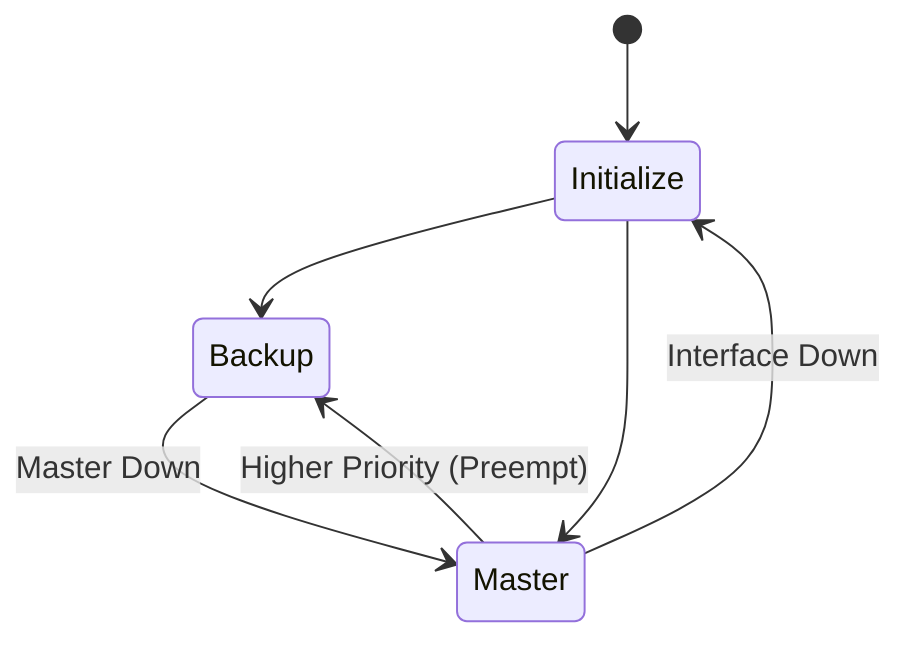

# 07. VRRP State Machine

---

# 학습 목표

이 장에서는 VRRP Router가 어떤 상태(State)를 가지며,
각 상태에서 어떤 동작을 수행하는지 이해한다.

- VRRP의 세 가지 상태를 설명할 수 있다.
- State Transition을 이해한다.
- Master Down Interval의 역할을 설명할 수 있다.
- Advertisement Timer와의 관계를 이해한다.

---

# VRRP State Machine이란?

VRRP Router는 항상 같은 역할을 수행하지 않는다.

상황에 따라

Master가 되기도 하고

Backup이 되기도 한다.

이러한 상태 변화를

State Machine(Finite State Machine)

이라고 한다.

VRRP는

세 가지 상태를 가진다.

---

# VRRP 상태

```text
Initialize

↓

Backup

↓

Master
```

Router는

이 세 가지 상태만 반복하며 동작한다.

---

# 1. Initialize

Initialize는

VRRP가 시작되는 초기 상태이다.

Router가 부팅되거나

VRRP가 활성화되면

가장 먼저

Initialize 상태가 된다.

이 상태에서는

아직 Master인지

Backup인지

결정되지 않았다.

---

# Initialize에서 수행하는 작업

├─ VRRP 시작

├─ 인터페이스 확인

├─ 설정 확인

├─ Priority 확인

├─ VRID 확인

└─ Advertisement 대기

---

# Initialize 이후

Priority를 확인한 후

Router는

Master

또는

Backup

상태로 이동한다.

```text
Initialize

↓

Priority 확인

↓

Master

또는

Backup
```

---

# 2. Backup

Backup 상태는

Master를 대신하기 위해 대기하는 상태이다.

평상시에는

Packet을 전달하지 않는다.

대신

Master가 보내는 Advertisement를 계속 수신한다.

---

# Backup에서 수행하는 작업

├─ Advertisement 수신

├─ Timer 유지

├─ Master 상태 감시

├─ Virtual IP 대기

└─ Failover 준비

---

# Backup 상태에서 계속 확인하는 것

Backup은

항상

Advertisement Packet이

도착하는지 확인한다.

```text
Master

↓

Advertisement

↓

Backup

↓

정상

↓

계속 대기
```

---

# Master Down Interval

Backup Router는

Advertisement가

일정 시간 동안 도착하지 않으면

Master가 장애라고 판단한다.

이 시간을

Master Down Interval

이라고 한다.

즉,

```text
Advertisement 수신

↓

Timer 초기화

↓

Advertisement 중단

↓

Timer 만료

↓

Master Down
```

---

# 3. Master

Master 상태는

현재 Gateway 역할을 수행하는 상태이다.

사용자는

Master Router를 통해

인터넷과 통신한다.

---

# Master에서 수행하는 작업

├─ Advertisement 송신

├─ Virtual IP 유지

├─ Virtual MAC 유지

├─ Packet 전달

├─ ARP 응답

└─ Gateway 제공

---

# 상태 전이(State Transition)

```text
Initialize

↓

Backup

↓

Advertisement 중단

↓

Master

↓

장애

↓

Initialize
```

상황에 따라

Router는

Master와 Backup을

계속 오가게 된다.

---

# Preempt가 있는 경우

더 높은 Priority Router가

네트워크에 다시 참여하면

```text
Backup

↓

Priority 비교

↓

Master 교체

↓

새 Master
```

가 된다.

이를

Preempt

라고 한다.

---

# 전체 동작 과정

```text
Router 부팅

↓

Initialize

↓

Priority 확인

↓

Backup

↓

Advertisement 감시

↓

Master 장애

↓

Master Down

↓

Master 승격

↓

Advertisement 전송

↓

Gateway 서비스
```

---

# Mermaid 다이어그램



---

# 실제 예시

Router A

Priority =150

↓

Master

Router B

Priority =100

↓

Backup

Router A 장애

↓

Advertisement 중단

↓

Backup Timer 만료

↓

Router B

↓

Master 승격

↓

Advertisement 시작

---

# Wireshark에서 확인

Backup 상태

↓

Advertisement 수신

Master 상태

↓

Advertisement 송신

장애 발생

↓

새로운 Master의 Advertisement 확인

---

# 시험 핵심

✔ VRRP는 Initialize, Backup, Master 세 가지 상태를 가진다.

✔ Backup은 Advertisement를 감시한다.

✔ Master는 Advertisement를 송신한다.

✔ Advertisement가 끊기면 Master Down으로 판단한다.

✔ Master Down 이후 Backup이 Master가 된다.

✔ Preempt는 높은 Priority Router가 Master를 다시 가져오는 기능이다.

---

# 암기법

Initialize

↓

Backup

↓

Advertisement 감시

↓

Master Down

↓

Master

↓

Advertisement 송신

---

# 면접 질문

Q. VRRP State Machine은 무엇인가?

Q. Backup 상태에서 수행하는 작업은 무엇인가?

Q. Master Down Interval이란 무엇인가?

Q. Advertisement Timer의 역할은 무엇인가?

Q. Preempt 기능은 State Machine에 어떤 영향을 주는가?

---

# 핵심 요약

VRRP는 Initialize, Backup, Master의 세 가지 상태를 이용하여 Gateway를 관리한다.

Backup은 Master의 Advertisement를 지속적으로 감시하며, Advertisement가 일정 시간 동안 수신되지 않으면 Master Down으로 판단하여 자동으로 Master 역할을 수행한다.

이러한 상태 전이를 State Machine이라고 하며, VRRP의 고가용성을 구현하는 핵심 메커니즘이다.