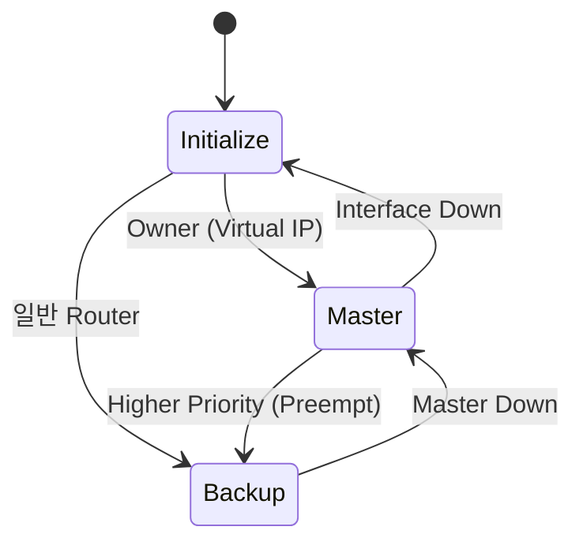

# 07. VRRP State Machine

---

# 학습 목표

이 장에서는 VRRP Router가 어떤 상태(State)를 가지며,
각 상태에서 어떤 동작을 수행하는지 이해한다.

- VRRP의 세 가지 상태를 설명할 수 있다.
- State Transition을 이해한다.
- Master Down Interval의 역할을 설명할 수 있다.
- Advertisement Interval과의 관계를 이해한다.
- Preempt 기능을 이해한다.

---

# VRRP State Machine이란?

VRRP Router는 항상 같은 역할을 수행하지 않는다.

상황에 따라 Master가 되기도 하고 Backup이 되기도 한다.

이러한 상태 변화를 State Machine(Finite State Machine)이라고 한다.

VRRP는 다음 세 가지 상태를 가진다.

```text
Initialize

↓

Backup

↓

Master
```

---

# 1. Initialize

Initialize는 VRRP가 시작되는 초기 상태이다.

Router가 부팅되거나 VRRP가 활성화되면 가장 먼저 Initialize 상태가 된다.

이 상태에서는 아직 Master인지 Backup인지 결정되지 않았다.

---

# Initialize에서 수행하는 작업

- VRRP 시작
- 인터페이스 확인
- VRID 확인
- Priority 확인
- Advertisement 대기

---

# Initialize 이후

Priority를 확인한 후 Router는 Master 또는 Backup 상태로 이동한다.

자신의 인터페이스 IP가 Virtual IP인 경우에는 바로 Master 상태가 된다.

```text
Initialize

↓

Priority 확인

↓

Master

또는

Backup
```

---

# 2. Backup

Backup 상태는 Master를 대신하기 위해 대기하는 상태이다.

평상시에는 Packet을 전달하지 않는다.

Master Router가 보내는 Advertisement를 계속 수신하면서 상태를 감시한다.

---

# Backup에서 수행하는 작업

- Advertisement 수신
- Timer 유지
- Master 상태 감시
- Failover 준비

---

# Master Down Interval

Backup Router는 Advertisement가 일정 시간 동안 도착하지 않으면 Master 장애로 판단한다.

이 시간을 Master Down Interval이라고 한다.

```
Master Down Interval

=

3 × Advertisement Interval

+

Skew Time
```

기본 Advertisement Interval은 1초이다.

---

# 3. Master

Master 상태는 현재 Gateway 역할을 수행하는 상태이다.

사용자는 Master Router를 통해 외부 네트워크와 통신한다.

---

# Master에서 수행하는 작업

- Advertisement 송신
- Virtual IP 유지
- Virtual MAC 유지
- ARP 응답
- Packet 전달
- Gateway 서비스 제공

---

# 상태 전이(State Transition)

```text
Initialize

↓

Backup

↓

Advertisement 미수신

↓

Master

↓

Interface Down

↓

Initialize
```

---

# Preempt

Preempt Mode가 활성화되어 있으면 더 높은 Priority를 가진 Router가 복구되었을 때 Master 역할을 다시 가져온다.

VRRP에서는 Preempt가 기본 활성화되어 있다.

```text
Backup

↓

Priority 비교

↓

더 높은 Priority

↓

Master 교체
```

---

# 전체 동작 과정

```text
Router 시작

↓

Initialize

↓

Priority 확인

↓

Backup

↓

Advertisement 감시

↓

Master Down Interval

↓

Master 승격

↓

Advertisement 전송

↓

Gateway 서비스
```

---

# Mermaid 다이어그램



---

# 실제 예시

```text
Router A

Priority = 150

↓

Master

------------------

Router B

Priority = 100

↓

Backup

------------------

Router A 장애

↓

Advertisement 중단

↓

Master Down Interval

↓

Router B

↓

Master 승격
```

---

# Wireshark에서 확인

Backup 상태

↓

Advertisement 수신

↓

Master 상태

↓

Advertisement 송신

↓

장애 발생

↓

새로운 Master Advertisement 확인

---

# 시험 핵심

✔ VRRP는 Initialize, Backup, Master 세 가지 상태를 가진다.

✔ Initialize 이후 Priority를 비교한다.

✔ 자기 IP가 Virtual IP이면 바로 Master가 된다.

✔ Backup은 Advertisement를 감시한다.

✔ Master는 Advertisement를 송신한다.

✔ Master Down Interval = 3 × Advertisement Interval + Skew Time

✔ Preempt는 기본 활성화되어 있다.

---

# 암기법

Initialize

↓

Backup

↓

Advertisement

↓

Master Down Interval

↓

Master

↓

Preempt

---

# 면접 질문

Q. VRRP State Machine이란 무엇인가?

Q. Backup 상태에서 수행하는 작업은 무엇인가?

Q. Master Down Interval이란 무엇인가?

Q. Advertisement Interval과 Master Down Interval의 관계는 무엇인가?

Q. Preempt 기능은 언제 동작하는가?

---

# 핵심 요약

VRRP Router는 Initialize, Backup, Master의 세 가지 상태를 반복하며 동작한다.

Backup Router는 Advertisement를 감시하다가 Master Down Interval 동안 Advertisement를 수신하지 못하면 Master 장애로 판단하여 Master로 승격한다.

Preempt가 활성화되어 있으면 더 높은 Priority Router가 복구될 때 Master 역할을 다시 가져온다.