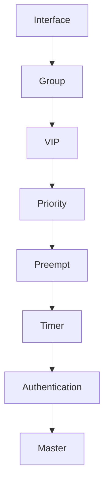

# 08. VRRP 설정 예시

---

# 학습 목표

이 장에서는 Cisco IOS 환경에서 VRRP를 설정하는 방법을 이해한다.

- VRRP 기본 설정 방법을 익힌다.
- Virtual IP를 설정할 수 있다.
- Priority를 변경할 수 있다.
- Preempt 기능을 활성화할 수 있다.
- Advertisement Timer를 설정할 수 있다.
- VRRP 상태를 확인할 수 있다.

---

# 기본 네트워크 구성

```text
                 Internet
                     │
        ┌────────────┴────────────┐
        │                         │
   ┌───────────┐            ┌───────────┐
   │ Router A  │            │ Router B  │
   │ Priority150│           │ Priority100│
   │  Master   │            │  Backup   │
   └───────────┘            └───────────┘
          │                      │
          └──────────┬───────────┘
                     │
             Virtual IP
          192.168.10.254
                     │
                 ┌────────┐
                 │ Switch │
                 └────────┘
                  │  │  │
                 PC1 PC2 PC3
```

---

# Router A (Master)

```bash
interface GigabitEthernet0/0

ip address 192.168.10.2 255.255.255.0

vrrp 10 ip 192.168.10.254

vrrp 10 priority 150

vrrp 10 preempt

vrrp 10 timers advertise 1

vrrp 10 authentication MyVRRPKey
```

---

# Router B (Backup)

```bash
interface GigabitEthernet0/0

ip address 192.168.10.3 255.255.255.0

vrrp 10 ip 192.168.10.254

vrrp 10 priority 100

vrrp 10 preempt

vrrp 10 timers advertise 1

vrrp 10 authentication MyVRRPKey
```

---

# 설정 명령 설명

| 명령 | 설명 |
|------|------|
| `vrrp 10 ip 192.168.10.254` | Virtual IP 설정 |
| `vrrp 10 priority 150` | Priority 설정 |
| `vrrp 10 preempt` | 높은 Priority Router가 Master 복귀 |
| `vrrp 10 timers advertise 1` | Advertisement 주기(1초) |
| `vrrp 10 authentication MyVRRPKey` | 인증 설정 |

---

# 상태 확인

```bash
show vrrp brief
```

예시

```text
Interface    Grp   Pri   State    Master addr

Gi0/0        10    150   Master   192.168.10.2

Group addr : 192.168.10.254
```

---

# 설정 순서

```text
Interface 선택

↓

VRRP Group 생성

↓

Virtual IP 설정

↓

Priority 설정

↓

Preempt 설정

↓

Advertisement Timer 설정

↓

Authentication 설정

↓

동작 확인
```

---

# 장애 예시

```text
Router A

↓

Master

↓

전원 OFF

↓

Advertisement 중단

↓

Router B

↓

Master 승격

↓

Gateway 유지

↓

Router A 복구

↓

Priority 비교

↓

Preempt

↓

Router A 다시 Master
```

---

# Mermaid 다이어그램



---

# Wireshark에서 확인

```text
Advertisement Packet

↓

224.0.0.18

↓

Protocol 112

↓

TTL 255

↓

Advertisement Interval 1 sec
```

---

# 시험 핵심

✔ Virtual IP는 모든 Router에서 동일하게 설정한다.

✔ Priority가 높은 Router가 Master가 된다.

✔ Preempt를 활성화하면 복구된 Router가 다시 Master가 된다.

✔ Advertisement Timer 기본값은 1초이다.

✔ show vrrp brief 명령으로 상태를 확인한다.

---

# 암기법

Interface

↓

VRRP Group

↓

Virtual IP

↓

Priority

↓

Preempt

↓

Advertisement Timer

↓

Authentication

↓

show vrrp brief

↓
show vrrp

---

# 면접 질문

Q. VRRP 기본 설정 순서는 무엇인가?

Q. Priority를 변경하는 이유는 무엇인가?

Q. Preempt는 언제 사용하는가?

Q. Advertisement Timer를 변경하는 이유는 무엇인가?

Q. show vrrp brief에서 확인할 수 있는 정보는 무엇인가?

---

# 핵심 요약

VRRP는 Interface에 Virtual IP와 Priority를 설정하여 Master와 Backup을 구성한다.

Priority가 높은 Router가 Master가 되며, Advertisement Timer와 Authentication을 설정하여 안정적인 VRRP 그룹을 운영할 수 있다.

설정 후에는 `show vrrp brief` 명령으로 Master, Priority, Virtual IP 등의 상태를 확인할 수 있다.