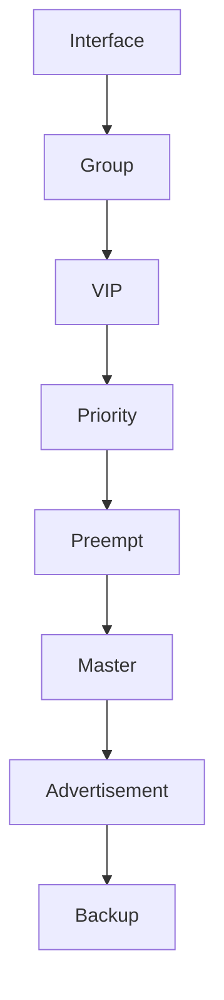

# 08. VRRP 설정 예시

---

# 학습 목표

이 장에서는 Cisco IOS 환경에서 VRRP를 설정하는 방법을 이해한다.

- VRRP 기본 설정 방법을 익힌다.
- Virtual IP를 설정할 수 있다.
- Priority를 변경할 수 있다.
- Preempt 기능을 활성화할 수 있다.
- VRRP 상태를 확인할 수 있다.

---

# VRRP 설정 순서

VRRP를 구성하는 일반적인 순서는 다음과 같다.

```text
Interface 선택

↓

VRRP 그룹 생성

↓

Virtual IP 설정

↓

Priority 설정

↓

Preempt 설정

↓

동작 확인
```

---

# 기본 네트워크

```text
                 Internet
                     │
      ┌──────────────────────────┐
      │                          │
 ┌─────────────┐          ┌─────────────┐
 │  Router A   │          │  Router B   │
 │ Priority150 │          │ Priority100 │
 │   Master    │          │   Backup    │
 └─────────────┘          └─────────────┘
          │                     │
          └──────────┬──────────┘
                     │
                Virtual IP
             192.168.10.254
                     │
                 ┌────────┐
                 │Switch  │
                 └────────┘
                  │   │   │
                 PC1 PC2 PC3
```

---

# Router A 설정

```bash
interface GigabitEthernet0/0

 ip address 192.168.10.1 255.255.255.0

 vrrp 10 ip 192.168.10.254

 vrrp 10 priority 150

 vrrp 10 preempt
```

설명

vrrp 10

↓

VRRP Group 10 생성

vrrp 10 ip

↓

Virtual IP 설정

priority 150

↓

Master 우선순위

preempt

↓

복구 시 Master 역할 복귀

---

# Router B 설정

```bash
interface GigabitEthernet0/0

 ip address 192.168.10.2 255.255.255.0

 vrrp 10 ip 192.168.10.254

 vrrp 10 priority 100

 vrrp 10 preempt
```

Router B는

Priority가 낮으므로

Backup으로 동작한다.

---

# Priority 변경

Priority가 높을수록

Master가 될 가능성이 높다.

```bash
vrrp 10 priority 200
```

예)

Router A

Priority 200

↓

Master

Router B

Priority 150

↓

Backup

---

# Preempt 설정

Preempt를 활성화하면

더 높은 Priority Router가

복구되었을 때

자동으로 Master를 다시 가져온다.

```bash
vrrp 10 preempt
```

Preempt가 없으면

현재 Master가

계속 Master 역할을 수행한다.

---

# Advertisement Timer

Advertisement 간격도 변경할 수 있다.

```bash
vrrp 10 timers advertise 1
```

의미

Advertisement Packet을

1초마다 전송한다.

---

# Authentication

VRRP Packet을

인증할 수도 있다.

```bash
vrrp 10 authentication text Cisco123
```

같은 Password를 사용하는

Router끼리만

VRRP 그룹을 형성한다.

---

# 상태 확인

VRRP 상태는

다음 명령으로 확인할 수 있다.

```bash
show vrrp brief
```

또는

```bash
show vrrp
```

확인 가능한 정보

├─ Master

├─ Backup

├─ Priority

├─ Virtual IP

├─ VRID

└─ Timer

---

# 설정 흐름

```text
Interface

↓

VRRP Group

↓

Virtual IP

↓

Priority

↓

Preempt

↓

Advertisement

↓

Master 결정
```

---

# Mermaid 다이어그램



---

# 실제 장애 예시

Router A

↓

Master

↓

전원 OFF

↓

Advertisement 중단

↓

Router B

↓

Master 승격

↓

Gateway 유지

↓

Router A 복구

↓

Priority 비교

↓

Preempt 활성

↓

Router A 다시 Master

---

# Wireshark에서 확인

정상 상태

↓

Advertisement Packet

1초마다 확인

장애 발생

↓

Advertisement 중단

↓

새로운 Master의 Advertisement 확인

---

# 시험 핵심

✔ Virtual IP는 모든 Router가 동일하게 설정한다.

✔ Priority가 높은 Router가 Master가 된다.

✔ Preempt는 Master를 다시 가져오는 기능이다.

✔ show vrrp로 상태를 확인할 수 있다.

✔ Advertisement Timer는 기본 1초이다.

---

# 암기법

Interface

↓

VRRP Group

↓

Virtual IP

↓

Priority

↓

Preempt

↓

Master

↓

Advertisement

↓

show vrrp

---

# 면접 질문

Q. VRRP 기본 설정 순서는 무엇인가?

Q. Priority를 변경하는 이유는 무엇인가?

Q. Preempt 기능은 언제 사용하는가?

Q. show vrrp 명령으로 확인할 수 있는 정보는 무엇인가?

Q. Advertisement Timer를 변경하는 이유는 무엇인가?

---

# 핵심 요약

VRRP는 Interface에 Virtual IP와 Priority를 설정하여 Master와 Backup을 구성한다.

Priority가 높은 Router가 Master가 되며, Preempt를 사용하면 복구된 Router가 다시 Master 역할을 수행할 수 있다.

설정이 완료되면 show vrrp 명령으로 현재 VRRP 상태를 확인할 수 있다.